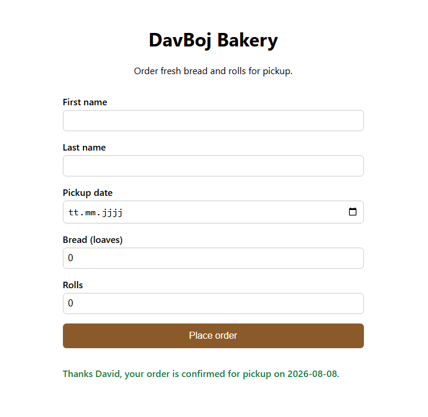
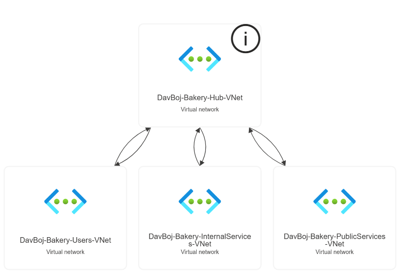
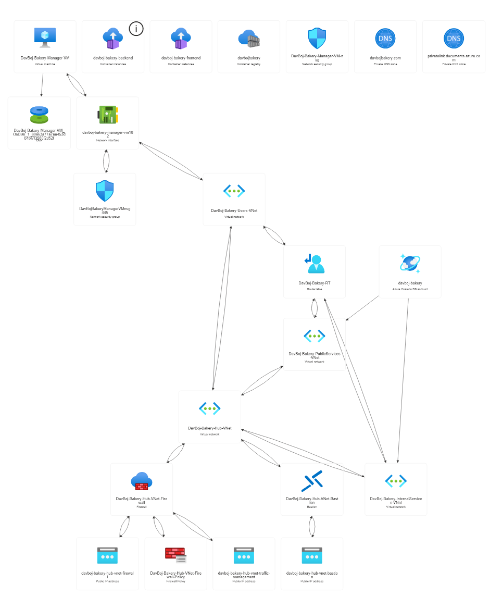

# DavBoj Bakery

A small demo project for "DavBoj Bakery": a public-facing Nuxt 3 page where customers
order bread and rolls for pickup. **Built to demonstrate a GitHub Actions CI/CD pipeline
that builds, tests, and pushes a container image to Azure Container Registry (ACR).**

## URL Address

[davboj-bakery.germanywestcentral.cloudapp.azure.com](http://davboj-bakery.germanywestcentral.cloudapp.azure.com/) \
*off to save credits*

## Backend

In order to check new orders, the backend server must be deployed
in a virtual network for *internal services*:
[davboj-bakery-backend](https://github.com/david-bojnansky/davboj-bakery-backend).

## App Preview



## Topology

### VNets



### All Resources



## Features

- Order form (first name, last name, pickup date, bread quantity, roll quantity)
- Shared validation logic (`shared/utils/validateOrder.ts`) used by both the form and
  the API route
- `POST /api/orders` server route that validates and saves each order to Azure Cosmos DB
- Vitest unit tests covering the validation rules
- Dockerfile producing a small Node runtime image
- GitHub Actions workflow: build & test, then (on `main`) build and push the image to ACR

## Getting started

```bash
npm install
npm run dev
```

The dev server needs Cosmos DB credentials to actually save an order (see below);
without them the form still renders but `POST /api/orders` will return a 500.

### Environment variables

Copy `.env.example` to `.env` and fill in your Cosmos DB details:

```
NUXT_COSMOS_ENDPOINT=https://<your-account>.documents.azure.com:443/
NUXT_COSMOS_KEY=<primary-key>
NUXT_COSMOS_DATABASE=davboj-bakery
NUXT_COSMOS_CONTAINER=orders
```

Provision the database once, e.g. with the Azure CLI:

```bash
az cosmosdb create --name <account-name> --resource-group <rg> --kind GlobalDocumentDB
az cosmosdb sql database create --account-name <account-name> --resource-group <rg> --name davboj-bakery
az cosmosdb sql container create \
  --account-name <account-name> --resource-group <rg> \
  --database-name davboj-bakery --name orders \
  --partition-key-path /pickupDate
```

### Scripts

| Script              | Purpose                                     |
| -------------------- | ------------------------------------------ |
| `npm run dev`        | Start the Nuxt dev server                  |
| `npm run build`      | Production build (Node server output)      |
| `npm run lint`       | ESLint                                     |
| `npm run typecheck`  | `nuxt typecheck` (vue-tsc)                 |
| `npm run test`       | Vitest unit tests                          |

## Docker

```bash
docker build -t davboj-bakery-frontend .
docker run -p 3000:3000 \
  -e NUXT_COSMOS_ENDPOINT=... \
  -e NUXT_COSMOS_KEY=... \
  davboj-bakery-frontend
```

## CI/CD

`.github/workflows/ci-cd.yml` runs on every push/PR to `main`:

1. **build-and-test** — install deps, lint, typecheck, run Vitest, and run `nuxt build`.
2. **docker-build-and-push** — only on a push to `main`, and only if the first job
   passes. Logs in to Azure Container Registry and builds/pushes the image tagged
   with both the commit SHA and `latest`.

The ACR login step expects three repository secrets:

| Secret          | Value                                      |
| --------------- | ------------------------------------------- |
| `ACR_HOST`      | ACR login server, e.g. `myregistry.azurecr.io` |
| `ACR_USERNAME`  | ACR admin username (or service principal id)   |
| `ACR_PASSWORD`  | ACR admin password (or service principal secret) |

This pipeline deliberately stops at "image pushed to ACR" — it prepares the app for
deployment. Rolling it out to a running service (e.g. Azure Container Apps or App
Service) would be a follow-up job that pulls the pushed image and updates the target
resource.

## Notes on this environment

This project was scaffolded by hand (no `npm install` was run here), so
`package-lock.json` is not yet committed. Run `npm install` locally once and commit the
generated lockfile so CI can use reproducible installs.
